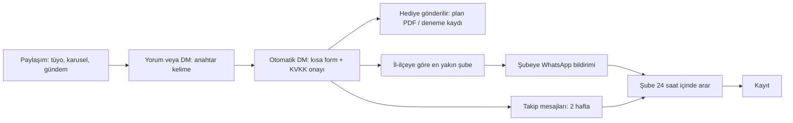

# Hocalara Geldik — Sosyal Medya Marka Blueprint'i (v1)

Bu belge, otomasyonun ürettiği her görselin uyduğu tek doğruluk kaynağıdır. Şablonlar, logolar ve fontlar bu klasörde; görseller `render.py` ile JSON veriden üretilir. Yapay zekâ yalnızca metin alanlarını doldurur; logo, renk ve düzen sabittir.

## 1. Renkler

| Rol | Ad | Kod | Kullanım |
|---|---|---|---|
| Ana | Mavi | `#3A589E` | Logo rengi, karusel kapakları, vurgular |
| Derin zemin | Lacivert | `#184077` | Duyuru ve kapanış kartlarının zemini, başlık metni |
| Vurgu | Turuncu | `#F19107` | Etiketler, adım numaraları, çağrı kutuları |
| Uyarı | Kiremit | `#F15725` | Yalnızca DUYURU / acil haber etiketi |
| Nötr | Beyaz | `#FFFFFF` | Metin zemini, lacivert üzerinde metin |
| Açık zemin | Buz mavisi | `#F2F5FB` | Karusel iç sayfaları, bilgi kutuları (paletten türetildi) |

Kural: Kiremit rengi yalnızca haber ve acil durum içeriklerinde kullanılır; takipçi bu rengi "önemli duyuru" olarak öğrenmeli.

## 2. Tipografi

- **Başlıklar:** Anton. Büyük, sıkışık, dikkat çekici. Cümle düzeninde yazılır (tamamı büyük harf değil).
- **Metin:** Montserrat 500, alt etiketler Montserrat 700.
- **Zemin notları:** Caveat (el yazısı). Yalnızca dekoratif katmanda kullanılır, içerik metninde asla.
- Başlık uzunsa motor puntoyu otomatik küçültür; alana sığmayan başlık asla taşmaz.

## 3. Logo kullanımı

**Tek logo:** Tüm paylaşımlarda yalnızca kutulu **"Hocalara Geldik Başarı Merkezi Planlama & Kurs"** logosu (`bm_kutu_planlama.png`) kullanılır. İçi beyaz dolgulu olduğu için hem koyu hem açık zeminde çalışır.

- Her görselde logo **bir kez** yer alır: şablona göre üstte (tüyo, şube) veya altta (duyuru, gündem, karusel, pazar özeti).
- Logo **etiket (sticker)** gibi kullanılır: düz (eğimsiz), dışında beyaz kontur ve altında yumuşak gölge. Zemin ne olursa olsun logo, fotoğraf veya renk alanının üstüne yapıştırılmış gibi durur.
- **Varsayılan yer: alt orta.** İkinci seçenek sağ üst köşe (başlık alanı ortada veya solda olduğunda). Kaynak rozeti olan kartlarda sağ alt.
- Boyut: görsel genişliğinin yaklaşık %25-35'i. Küçük bir imza değil, net okunan bir etikettir.
- Eski yazı logosu (`wordmark_*`) ve eski "Başarı Merkezi" logoları (`bm_mavi_turuncu`, `bm_beyaz`, `bm_kutu`) artık paylaşımlarda kullanılmaz; arşivde tutulur.
- Oynat amblemi (`amblem_*`) yalnızca zemin filigranı ve şube bandındaki küçük ikon olarak kullanılabilir; logo yerine geçmez.

Yasaklar: Logo yeniden çizilmez, yapay zekâyla üretilmez, rengi değiştirilmez, gölge veya efekt eklenmez. Logonun etrafında en az logonun "O" harfi yüksekliği kadar boşluk bırakılır.

## 4. Marka imzası

Kutulu logodaki hafif eğik, yuvarlak köşeli kutu tüm şablonlarda **etiket** olarak kullanılır (−2,5° eğim). Etiket her görselde en fazla bir kez yer alır ve içeriğin türünü ya da çağrıyı söyler.

## 4a. Referans tasarım dili (mevcut HG paylaşımlarından)

Markanın mevcut paylaşımlarında oturmuş dil; otomatik şablonlar bu dile uyar:

- **Turuncu kurdele:** Görselin içinden akan kalın, dalgalı turuncu şerit (S / dalga formu). Fotoğrafın veya figürün arkasından geçer, derinlik verir. Markanın en tanınır öğesidir.
- **Başlık kutuları:** Büyük, sıkışık, büyük harfli başlıklar; kelimeler turuncu veya lacivert dikdörtgen bantların üstünde, hafif eğik.
- **El yazısı vurgu:** Başlığın altında tek satır el yazısı ("Kutlu Olsun", "Bu Hafta", "Mübarek Olsun"), çoğunlukla turuncu veya beyaz, altında fırça çizgisi.
- **Vurgu çizgileri:** Başlık köşesinde üç kısa "patlama" çizgisi; kıvrımlı ok.
- **Kampanya dili: "GEL."** "Sen de #gel.", "Denemeye GEL!", "Hedefin için doğru nokta." Kapanış çağrılarında bu dil kullanılır.
- **İnsan görselleri:** Arka planı temizlenmiş öğrenci figürleri (lacivert kapüşonlu, "GEL." yazılı), yaşa uygun; iş birliği ve ürün tanıtımlarında 3B karakter tarzı da kullanılır.
- **Amblem filigranı:** Oynat amblemi soluk, büyük, köşeden taşarak.

## 4b. Zemin dokusu

Hiçbir zemin düz bırakılmaz. Üç katman kullanılır:
- **Kareli defter ızgarası** (54 px): koyu zeminde beyaz %7, açık zeminde mavi %7-10.
- **Karalama katmanı:** El yazısıyla formüller (x² + y² = r², π, Δ = b² − 4ac, f(x), √2) ve el çizimi şekiller (yıldız, üçgen, daire, ok). Koyu zeminde beyaz %13, açık zeminde mavi %12-16. Metnin okunmasını asla engellemeyecek kadar soluk.
- **Turuncu tarama lekesi:** Amblemdeki karalama tarama dokusundan türetildi; köşeden taşarak girer. Karuselde çift sayfalarda aynalanır, böylece kaydırırken sayfalar birbirinin kopyası gibi durmaz.

## 4c. Öğrenci görselleri

- **Yaş kuralı:** İçerikte YKS ön plandaysa öğrenci 17-18 yaşında, LGS ön plandaysa 14-15 yaşında görünür. Karışık içerikte iki yaş grubu birlikte kullanılabilir.
- **Tarzlar:** Gerçekçi fotoğraf (yapay zekâ ile) ve hafif çizim. Çizimlerde mavi baskın olmaz; karakalem ya da açık tonlu çizim, turuncu yalnızca küçük vurgu.
- **Tarz seçimi paylaşıma göre yapılır:** Gerçekçi mi, karakalem mi, açık tonlu çizim mi olacağına içeriğin konusu ve metnin tonu karar verir. Otomasyon öneri sunar, son karar onay aşamasında verilir.
- Görseller her paylaşımda yeniden üretilmez; onaylı, etiketli bir kütüphaneden seçilir.
- Gerçek öğrenci fotoğrafı yalnızca velinin yazılı rızasıyla kullanılır.

## 4d. Resmi kurum logoları (MEB, ÖSYM, YÖK)

- LGS, YKS veya kurum duyurularında ilgili kurum, duyuru kartının altındaki **Kaynak rozetinde** gösterilir: kurumun resmi logo dosyası + kurum adı.
- Kurum logosu kaynak rozetinde, net tanınacak boyutta (yükseklik 104 px) ve beyaz zemin üzerinde kullanılır. HG logosuyla yan yana ortaklık izlenimi veren bir düzende, başlık alanında ya da büyük boyutta kullanılmaz.
- Logolar yeniden çizilmez veya üretilmez; yalnızca kurumun resmi dosyası kullanılır. Dosya yoksa rozet metin olarak çıkar.

## 4e. Mevcut paylaşım formatları (referans)

| Format | Örnek | Yapı | Logo |
|---|---|---|---|
| Özel gün (milli ve dini) | 30 Ağustos, 9 Eylül, Mevlid Kandili | Büyük başlık + el yazısı "Kutlu / Mübarek Olsun", tarihi fotoğraf veya tematik görsel, turuncu kurdele; satış çağrısı yok | Alt orta |
| Deneme Kulübü genel | "Deneme Kulübü", NET ARTIŞINA GEL akışı | Başlık kutuları, 4 adımlı fayda akışı (ikon + "GEL."), öğrenci fotoğrafı, megafon çağrısı | Alt orta |
| Deneme Kulübü haftalık | "Deneme Kulübünde Bu Hafta" | Yayın adı + sınav türü kutusu, kitapçık görseli, "sen de denemeye #GEL." | Alt orta |
| Deneme Kulübü grup | LGS Grubu / YKS Grubu | Yayın logoları ızgarası, yaşa uygun öğrenci (LGS 14-15, YKS 17-18) | Sağ üst |
| İş birliği / ürün | LIMY, Vip PsikoKoç | Güçlü başlık, ürün ekranı (telefon / tablet), karakter veya fotoğraf, "sen de #gel." | Alt orta |
| Şube reklamı | Hizmet listesi + HEMEN ARA | Onay işaretli hizmet listesi, "Kontenjanlar sınırlı" rozeti, büyük telefon butonu, öğrenci fotoğrafı | Üst |

Kurallar:
- Şube adı gereken paylaşımlarda (ör. "Kadıköy'de", "Yakuplu Başarı Merkezi") ana logo değişmez; şube adı ayrı bir etiket veya konum rozeti olarak eklenir. Şubeye özel logo varyantları (farklı renk, "Premium" vb.) otomatik paylaşımlarda kullanılmaz.
- Yayınevi logoları yalnızca iş birliği yapılan yayınlar için, resmi dosyalarıyla kullanılır.
- Özel gün paylaşımları dönemsel takvime eklenir (milli bayramlar, anma günleri, dini bayram ve kandiller) ve satış çağrısı taşımaz.

## 5. Şablonlar (1080×1350, Instagram dikey)

| Şablon | Amaç | Doldurulan alanlar |
|---|---|---|
| `duyuru` | Eğitim gündemi, ÖSYM/MEB haberleri | etiket, baslik, satirlar (etiket–değer çiftleri), not, kaynak |
| `sube` | Şubeye yönlendirme | sube, baslik, aciklama, bilgiler (etiket–değer), whatsapp, adres |
| `karusel_kapak` | Karusel ilk sayfa | etiket, baslik, alt_baslik |
| `karusel_adim` | Karusel iç sayfa (sıralı adımlar) | no, baslik, metin, sira, toplam |
| `karusel_son` | Karusel kapanış | baslik, metin, cagri |
| `gundem` | Öğretmen / memur / KPSS gündemi, bilgi kartı | seri, baslik, ozet, maddeler, kaynak, kaynak_logo |
| `tuyo` | Günün tüyosu (LGS / YKS / KPSS). Mavi zemin, kutulu "Başarı Merkezi Planlama & Kurs" logosu, beyaz kart | sinav, baslik, aciklama, ornek (isteğe bağlı), cagri + anahtar (isteğe bağlı: turuncu çağrı bandı ve yorum anahtar kelimesi) |
| `haftalik_ozet` | Pazar sabahı haftanın gündemi | baslik, tarih, ogeler (seri–cümle) |

## 6. Metin kuralları

- Başlık en fazla 8-9 kelime. Metin en fazla 2 kısa cümle.
- Öğrenciye "sen" diliyle, sade ve net. Ünlem ve emoji yok.
- Haber içeriklerinde her tarih ve kural resmi kaynaktan gelir; `kaynak` alanı boş bırakılamaz.
- Hiçbir içerik Vural Hoca'nın Telegram onayı olmadan yayınlanmaz.

## 7. Otomasyona bağlama (n8n)

1. n8n içerik türüne göre JSON üretir (Claude metni yazar, şablon adı ve alanlar sabit).
2. `render.py` bir render servisinde çalışır ve PNG döndürür.
3. PNG Telegram'a onaya gider → Onayla / Revize / Reddet.
4. Onaylanan görsel Metricool ile ana hesaba ve şubelere planlanır.

## 8. Hesabın rolü ve kitleler

Ana hesap, üç kitlenin her gün takip ettiği bir **eğitim bilgi merkezidir**: öğretmenler ve memurlar (gündem, mevzuat, atama, ücret), KPSS adayları (gündem ve tüyo), LGS ve YKS öğrencileri ile velileri (tüyo, duyuru, şube).

**Asıl amaç değişmez: başarı merkezlerine öğrenci çekmek.** Öğretmen, memur ve KPSS içerikleri takipçi ve güven kazandırır; bu kitlenin önemli bir kısmı aynı zamanda LGS/YKS çağında çocuğu olan velilerdir. Her içerik serisi, doğrudan ya da dolaylı olarak şubelere yönlendiren bir yola bağlanır (bkz. bölüm 10).

İçerikler tanınır serilere ayrılır; her serinin etiket rengi sabittir:

| Seri | Etiket rengi | Şablon |
|---|---|---|
| Öğretmen gündemi | Mavi | gundem |
| Memur gündemi | Lacivert | gundem |
| KPSS gündemi | Turuncu | gundem |
| Bilgi kartı | Mavi | gundem |
| Günün tüyosu (LGS / YKS / KPSS) | Turuncu + sınav rozeti | tuyo |
| Duyuru (ÖSYM / MEB / YÖK) | Kiremit | duyuru |
| Haftalık karusel | Konuya göre | karusel_* |
| Pazar özeti | Turuncu | haftalik_ozet |

## 9. Günlük üretim planı

### 9.1 Ana hesap: her gün iki paylaşım (haftada 14)

| Gün | Sabah (08:00 civarı) | Akşam (19:00-20:00) |
|---|---|---|
| Pazartesi | Öğretmen gündemi | Günün tüyosu: YKS |
| Salı | Memur gündemi | Günün tüyosu: LGS |
| Çarşamba | KPSS gündemi | Haftalık karusel (4 haftalık rotasyon) |
| Perşembe | Öğretmen gündemi | Günün tüyosu: KPSS |
| Cuma | Memur gündemi | Günün tüyosu: YKS |
| Cumartesi | Bilgi kartı (takvim / mevzuat hatırlatması) | Günün tüyosu: LGS + şube çağrısı |
| Pazar | Pazar özeti (haftanın eğitim gündemi) | Günün tüyosu: veliye yönelik, şube çağrısıyla |

- Sabah gündemi için o gün haber yoksa aynı serinin **bilgi kartı** paylaşılır; boş gün olmaz.
- Resmi bir duyuru (ÖSYM / MEB / YÖK) geldiğinde **duyuru kartı** o günün sabah veya akşam yuvasının önüne geçer; çok önemliyse ek paylaşım olarak girer.
- Günlük sıra başlangıç planıdır; ilk 6-8 haftanın verisine göre seri ağırlıkları ve saatler ayarlanır.

**Haftalık karusel rotasyonu:** 1) YKS çalışma taktiği, 2) veli köşesi, 3) LGS çalışma taktiği / konu özeti, 4) sınav psikolojisi ve motivasyon.

### 9.2 Şube hesapları

Şubeler öğretmen, memur ve KPSS gündemini **paylaşmaz** (velilerini ilgilendirmez, spam riski yaratır). Şubelere giden:

- Haftalık karusel
- Haftada 3 LGS/YKS tüyosu (şube çağrılı olanlar öncelikli)
- 2 haftada bir şube yönlendirme görseli
- LGS/YKS duyuruları

Aynı içerik şubelerde 2-3 güne ve farklı saatlere dağıtılır; 30 hesaptan aynı anda paylaşım yapılmaz.

### 9.3 Kaynaklar

- **Gündem ve duyurular:** Yalnızca resmi kaynaklar: Resmî Gazete, MEB, ÖSYM, YÖK ve ilgili kamu kurumlarının resmi duyuruları. Haber siteleri yalnızca ipucu olarak kullanılır; bilgi resmi kaynaktan doğrulanmadan kart üretilmez.
- **Tüyolar:** Onaylı bir tüyo bankasından beslenir; banka Pazar toplu onayında büyür.

### 9.4 Onay ritmi

- **Pazar akşamı toplu onay:** Gelecek haftanın tüyoları, karuseli ve şube görselleri (yaklaşık 10-15 dakika).
- **Günlük anlık onay:** Gündem haberleri ve duyurular geldikçe (günde 1-3 dokunuş).
- Ücret, maaş, ek ders, atama tarihi gibi rakam içeren her gündem kartı, kaynak bağlantısıyla birlikte onaya düşer; kaynak bağlantısı olmayan kart onaya gönderilmez.

## 10. Başarı merkezlerine öğrenci çekme sistemi

İçerik ilgi yaratır; öğrenciyi getiren, ilgiyi iletişim bilgisine, iletişim bilgisini şubede görüşmeye çeviren sistemdir.

### 10.1 Mıknatıslar (ücretsiz değer karşılığı iletişim bilgisi)

| Anahtar kelime | Ne verilir | Kitle |
|---|---|---|
| PLAN | Haftalık LGS veya YKS çalışma planı (PDF) | Öğrenci, veli |
| DENEME | **Deneme Kulübü**'ne kayıt veya şubede ücretsiz deneme / seviye tespit | Öğrenci, veli |
| REHBER | Veliler için sınav ve tercih süreci rehberi (PDF) | Veli (öğretmen ve memur takipçiler dahil) |
| KPSS | KPSS çalışma planı (PDF) | KPSS adayı |

- **En güçlü kaldıraç: Deneme Kulübü.** Şubelerde zaten yürüyen, Türkiye geneli yayınların denemelerinin uygulandığı Deneme Kulübü, sistemin ana mıknatısıdır. Haftalık "Bu hafta Deneme Kulübünde" paylaşımları DENEME anahtar kelimesiyle kayıt toplar; öğrenci fiziksel olarak şubeye gelir, bu da kayda en yakın adımdır.

### 10.2 Toplama: Instagram DM otomasyonu

- Takipçi paylaşımın altına anahtar kelimeyi yazar veya DM atar → otomatik DM gelir.
- DM kısa form sorar: veli mi öğrenci mi, sınıf / sınav, il ve ilçe, telefon.
- **KVKK:** Aydınlatma metni ve açık rıza onayı alınmadan telefon kaydedilmez. 18 yaş altı için veli telefonu istenir. Metinler hukukçu onayından geçer.
- Hediye (PDF veya deneme kaydı onayı) anında gönderilir.
- Resmi Instagram mesajlaşma altyapısı kullanılır (Meta'nın resmi API'si veya onaylı bir DM otomasyon aracı); gayriresmi bot araçları hesabı riske atar.

### 10.3 Yönlendirme ve takip

- n8n, il-ilçeye göre en yakın şubeyi bulur; şubeye WhatsApp ile aday bilgisi gider.
- Aday bir veritabanına kaydolur: kaynak seri, anahtar kelime, şube, tarih, durum (yeni / arandı / görüşme / kayıt).
- Şube 24 saat içinde arar ve durumu tek dokunuşla günceller. Güncellenmezse şubeye ve Vural Hoca'ya hatırlatma gider.
- Aday, iki hafta boyunca birkaç takip mesajı alır (plan, deneme daveti, şube adresi). WhatsApp takip mesajları için onay alınmış olmalıdır.

### 10.4 İçerikteki çağrı kuralları

- Haftada en az 3 paylaşım anahtar kelimeli çağrı taşır (turuncu çağrı bandı).
- Aylık deneme haftasında her akşam paylaşımı deneme çağrısı taşır.
- Öğretmen ve memur gündeminde veli köprüsü: çocuğu olan veliler için REHBER çağrısı.

### 10.5 Raporlama

Her pazartesi Telegram'a haftalık rapor: şube bazında aday sayısı, arama oranı, kayıt sayısı ve hangi seri / anahtar kelimenin kaç aday getirdiği. İçerik planındaki seri ağırlıkları bu veriye göre değiştirilir. Öğrenci başına ödeme modeli sayesinde şubeler adayları aramakla doğrudan ilgilidir; rapor bu takibi görünür kılar.
